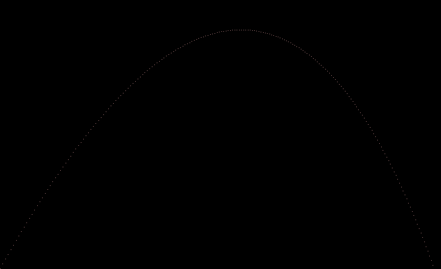
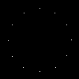
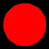
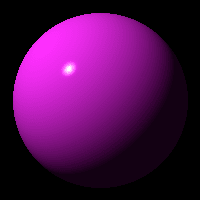

 # Table of Contents
<div class="toc" style="margin-top: 1em;"><ul class="toc-item" id="toc-level0"><li><span><a href="http://localhost:8888/notebooks/Dropbox/Prepared/RayTracer/HaskellVersion/raytracer/README.md#A-ray-tracer-from-scratch,-in-Haskell" data-toc-modified-id="A-ray-tracer-from-scratch,-in-Haskell-1"><span class="toc-item-num">1&nbsp;&nbsp;</span>A ray tracer from scratch, in Haskell</a></span><ul class="toc-item"><li><span><a href="http://localhost:8888/notebooks/Dropbox/Prepared/RayTracer/HaskellVersion/raytracer/README.md#Tuples,-Points-and-Vectors" data-toc-modified-id="Tuples,-Points-and-Vectors-1.1"><span class="toc-item-num">1.1&nbsp;&nbsp;</span>Tuples, Points and Vectors</a></span></li><li><span><a href="http://localhost:8888/notebooks/Dropbox/Prepared/RayTracer/HaskellVersion/raytracer/README.md#Drawing-on-a-canvas" data-toc-modified-id="Drawing-on-a-canvas-1.2"><span class="toc-item-num">1.2&nbsp;&nbsp;</span>Drawing on a canvas</a></span></li><li><span><a href="http://localhost:8888/notebooks/Dropbox/Prepared/RayTracer/HaskellVersion/raytracer/README.md#Matrices" data-toc-modified-id="Matrices-1.3"><span class="toc-item-num">1.3&nbsp;&nbsp;</span>Matrices</a></span></li><li><span><a href="http://localhost:8888/notebooks/Dropbox/Prepared/RayTracer/HaskellVersion/raytracer/README.md#Matrix-transformations" data-toc-modified-id="Matrix-transformations-1.4"><span class="toc-item-num">1.4&nbsp;&nbsp;</span>Matrix transformations</a></span></li></ul></li></ul></div>


# A ray tracer from scratch, in Haskell

This project implements a ray tracer, following the excellent book [The Ray Tracer challenge](http://raytracerchallenge.com), by Jamis Buck.

- [x] Tuples, Points and Vectors
- [x] Drawing on a canvas
- [x] Matrices
- [x] Matrix Transformations
- [x] Ray-sphere intersections
- [x] Light and Shading
- [ ] Making a scene
- [ ] Shadows
- [ ] Planes
- [ ] Patterns
- [ ] Reflection and Refraction
- [ ] Cubes
- [ ] Cylinders
- [ ] Groups
- [ ] Triangles
- [ ] Constructive Solid Geometry
- [ ] Next Steps

## Tuples, Points and Vectors

Points and vectors are represented as 4-tuples of Floats, with the difference that points always end with a 1 as last coordinate, like (4, -4, 3, 1), and vectors always end with a 0.

```haskell
data RTCTuple a = RTCTuple {x, y, z, w ::a} deriving (Eq, Show)
```

This chapter implements basic arithmetic operations on those tuples: addition, subtraction, multiplication by a scalar, approximate equality, dot product, cross product, etc...

## Drawing on a canvas

Colors are introduced as (r,g,b) tuples that are Num instances, allowing some simple operations on colors:

```haskell
newtype Color = Color (Float, Float, Float) deriving (Eq, Show)

instance Num Color where
    Color (r1, g1, b1) + Color (r2, g2, b2) = Color (r1 + r2, g1 + g2, b1 + b2)
    Color (r1, g1, b1) - Color (r2, g2, b2) = Color (r1 - r2, g1 - g2, b1 - b2)
    _ * _ = undefined
    abs _ = undefined
    signum _ = undefined
    fromInteger _ = undefined
    negate (Color (r, g, b)) = Color (-r, -g, -b)
```

From there the notion of **canvas** is defined as a rectangular grid of pixels:
```haskell
-- Pixel matrix
type PixelMatrix = Array (Int, Int) Color

-- Canvas
newtype Canvas = Canvas PixelMatrix deriving (Show)

```
One can write a pixel at a given position
```haskell
writePixelAt :: Canvas -> Int -> Int -> Color -> Canvas
writePixelAt (Canvas m) i j c = if (outsideCanvas i j (Canvas m)) then (Canvas m) 
    else Canvas (m // [((i,j), c)])
```
and also write a PPM file from a canvas, to visualize our work:
```haskell
ppmFromCanvas :: Canvas -> String
ppmFromCanvas c = unlines ("P3" : [show w ++ " " ++ show h ] ++ ["255"] ++ pixelData c)
    where
        w = width c
        h = height c
```

As an example, the chapter ends with the plotting of a simple parabolic trajectory:




## Matrices

Matrices are introduced, with operations on them: addition, multiplication, transposition, inversion. 
Keeping the implementation as simple as possible I chose my matrices to be represented as arrays:

```haskell
type Matrix a =  Array (Int, Int) a
```

## Matrix transformations

In this chapter we translate, scale, rotate, shear, and chain various matrices. 

Here is an example of how the rotation looks like in my implementation:

```haskell
rotation_x:: Float -> Matrix Float
rotation_x r = Matrix.createMatrixFromList 4 4 [[1.0, 0.0, 0.0, 0.0::Float],
                                 [0.0, cosr, (-sinr), 0.0::Float],
                                 [0.0, sinr, cosr, 0.0::Float],
                                 [0.0, 0.0, 0.0, 1.0::Float]]
                        where cosr = cos r
                              sinr = sin r
```
As usual, the chapter ends with a challenge: draw the 12 positions of the exact hours of a clock (using matrix rotations).



## Ray-sphere intersections

Rays are created :

```haskell
data Ray a = Ray {origin::RTCTuple a, direction::RTCTuple a} deriving (Eq, Show)
```

They can intersect spheres. First a unit sphere centered at the origin is defined. More general spheres are defined by applying transformations to that simple sphere. 

```haskell
data Sphere = Sphere {sphereId::Int, transform::Matrix Float, material:: Material}
  deriving (Eq,Show)

data Object = Object Sphere  deriving (Eq, Show)

sphere:: Sphere
sphere = Sphere {sphereId = 0, Sphere.transform = Matrix.identity, material = defaultMaterial}
```

This chapter's challenge is to compute the projection of a sphere onto a wall:


## Light and shading

Here we implement the Phong Reflection Model and use it to render a simple sphere:


